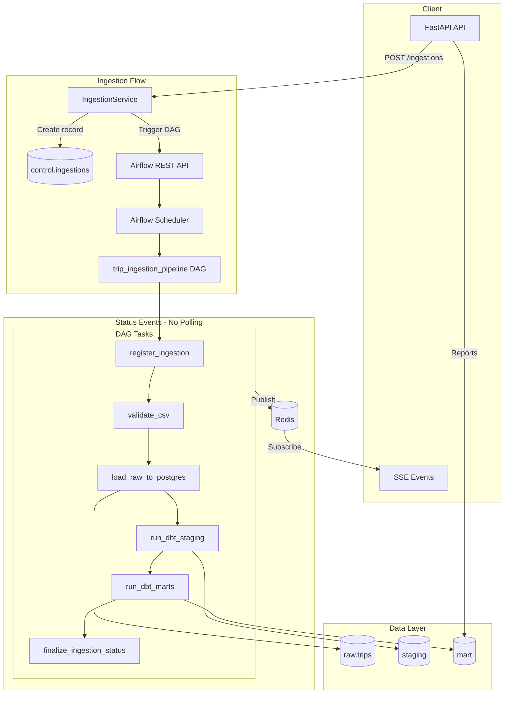
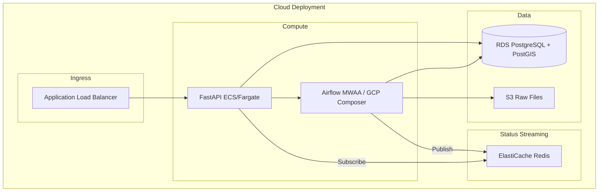

# Trip Ingestion Data Engineering Project (Airflow)

## Architecture Overview




## 1. Project Structure

```
de_challenge/
├── api/
│   ├── __init__.py
│   ├── main.py                    # FastAPI app
│   ├── routes/
│   │   ├── ingestions.py          # POST /ingestions, GET /ingestions/{id}
│   │   ├── events.py              # GET /ingestions/{id}/events (SSE)
│   │   └── reports.py             # GET /reports/weekly-average/bbox, /region
│   └── dependencies.py
├── services/
│   ├── __init__.py
│   ├── ingestion_service.py       # Create ingestion, trigger Airflow DAG
│   └── report_service.py         # Weekly avg by bbox/region
├── airflow/
│   ├── dags/
│   │   └── trip_ingestion_pipeline.py
│   ├── plugins/
│   │   └── operators/
│   │       ├── validate_csv.py
│   │       ├── load_raw.py
│   │       └── run_dbt.py
│   └── Dockerfile
├── sql/
│   ├── init/                      # Run on postgres init
│   │   ├── 001_extensions.sql     # PostGIS
│   │   ├── 002_control_schema.sql
│   │   ├── 003_raw_schema.sql
│   │   ├── 004_staging_schema.sql
│   │   ├── 005_mart_schema.sql
│   │   └── 006_ref_schema.sql
│   └── bonus_queries.sql
├── dbt/
│   ├── dbt_project.yml
│   ├── profiles.yml
│   ├── models/
│   │   ├── staging/
│   │   │   ├── stg_trips.sql      # time_bucket, week_start, origin_grid, dest_grid
│   │   │   └── _staging_schema.yml
│   │   └── marts/
│   │       ├── mart_trip_groups.sql
│   │       ├── mart_weekly_trips.sql
│   │       └── _marts_schema.yml
│   └── macros/
├── dataset/
│   └── trips.csv
├── docker-compose.yml
├── Dockerfile.api
├── requirements.txt
└── README.md
```

## 2. Database Schemas

### control schema

- **control.ingestions**: `id` (UUID), `file_path`, `status` (pending/running/completed/failed), `dag_run_id`, `rows_received`, `rows_loaded`, `rows_rejected`, `error_message`, `started_at`, `finished_at`, `created_at`, `updated_at`
- DAG tasks update this table; Redis pub/sub streams status to SSE (no DB polling)

### raw schema

- **raw.trips**: `id` (bigserial), `ingestion_id` (FK), `region`, `origin_lat`, `origin_lon`, `destination_lat`, `destination_lon`, `trip_datetime` (timestamptz), `datasource`, `ingested_at` (timestamptz)
- **No PostGIS in raw** — store lat/lon as numeric; geometry built only in staging
- Partitioning for 100M rows: **range by `trip_datetime`** (monthly); fallback to `ingested_at` if needed
- Indexes: B-tree on `region`, `trip_datetime`, `ingestion_id`
- Load task parses CSV `POINT (lon lat)` WKT and extracts lat/lon for COPY

### staging schema (dbt)

- **staging.stg_trips**: Build `origin_geom`, `destination_geom` via `ST_SetSRID(ST_MakePoint(origin_lon, origin_lat), 4326)`; then `origin_grid = ST_GeoHash(origin_geom, 5)`, `destination_grid = ST_GeoHash(destination_geom, 5)`; `time_bucket` = night/morning/afternoon/evening; `week_start`

### mart schema (dbt)

- **mart.mart_trip_groups**: Grouped by `origin_grid`, `destination_grid`, `time_bucket`
- **mart.mart_weekly_trips**: Weekly aggregates by region and grid cell for bbox queries

### ref schema

- **ref.regions** (optional): Lookup table for region metadata if needed

## 3. Airflow DAG: trip_ingestion_pipeline


| Task                          | Description                                                                                                                                                                                 |
| ----------------------------- | ------------------------------------------------------------------------------------------------------------------------------------------------------------------------------------------- |
| **register_ingestion**        | Create/update control.ingestions; set status=running, `started_at`=now; store dag_run_id                                                                                                    |
| **validate_csv**              | Check [dataset/trips.csv](dataset/trips.csv) exists; validate schema (region, origin_coord, destination_coord, datetime, datasource); fail DAG if invalid                                   |
| **load_raw_to_postgres**      | Parse WKT to lat/lon; batch COPY to raw.trips (origin_lat, origin_lon, destination_lat, destination_lon, trip_datetime); update rows_received, rows_loaded, rows_rejected; publish to Redis |
| **run_dbt_staging**           | BashOperator: `dbt run --select staging.`*                                                                                                                                                  |
| **run_dbt_marts**             | BashOperator: `dbt run --select marts.`*                                                                                                                                                    |
| **finalize_ingestion_status** | Set status=completed/failed, `finished_at`=now; publish final event to Redis                                                                                                                |


- DAG triggered via Airflow REST API: `POST /api/v1/dags/trip_ingestion_pipeline/dagRuns` with `{"conf": {"ingestion_id": "uuid", "file_path": "dataset/trips.csv"}}`
- API's POST /ingestions: (1) insert control.ingestions, (2) call Airflow API to trigger DAG with conf

## 4. API Endpoints


| Method | Path                           | Description                                                                                         |
| ------ | ------------------------------ | --------------------------------------------------------------------------------------------------- |
| POST   | /ingestions                    | Body: `{"file_path": "dataset/trips.csv"}`; creates ingestion, triggers DAG; returns `ingestion_id` |
| GET    | /ingestions/{id}               | Returns ingestion record (status, rows_loaded, etc.)                                                |
| GET    | /ingestions/{id}/events        | SSE stream of status/event updates (optional Redis pub/sub or DB polling)                           |
| GET    | /reports/weekly-average/bbox   | Query params: `min_lon`, `min_lat`, `max_lon`, `max_lat`                                            |
| GET    | /reports/weekly-average/region | Query param: `region=Prague`                                                                        |


## 5. SSE for Ingestion Status (No Polling)

**Option A — Optional Redis**: If Redis is in Docker Compose, DAG tasks publish to `ingestion:{id}:events`; API SSE endpoint subscribes and streams. Fallback: DB polling.

**Option B — DB-only**: Use `control.ingestion_events`. SSE endpoint runs async loop: poll `SELECT * FROM control.ingestion_events WHERE ingestion_id = $1 ORDER BY created_at` every 1–2s, yield new rows as SSE events. Simpler, no Redis dependency.

## 6. Docker Compose Services


| Service           | Image                  | Purpose                                                             |
| ----------------- | ---------------------- | ------------------------------------------------------------------- |
| postgres          | postgis/postgis:16-3.4 | PostgreSQL + PostGIS; init scripts in `/docker-entrypoint-initdb.d` |
| airflow-webserver | apache/airflow:2.8     | Airflow UI                                                          |
| airflow-scheduler | apache/airflow:2.8     | DAG scheduling                                                      |
| airflow-init      | apache/airflow:2.8     | One-off init (create admin, DB)                                     |
| api               | Dockerfile.api         | FastAPI + Uvicorn                                                   |
| redis             | redis:7-alpine         | Optional; for SSE pub/sub                                           |


- Shared network; postgres volume; Airflow uses postgres as metadata DB
- Env: `DATABASE_URL`, `AIRFLOW__CORE__SQL_ALCHEMY_CONN`, `AIRFLOW__API__AUTH_BACKENDS`

## 7. dbt Staging Model Details (Standardized Similarity)

**stg_trips** builds geometry from raw lat/lon, then applies standardized definitions:

- `origin_geom`: `ST_SetSRID(ST_MakePoint(origin_lon, origin_lat), 4326)`
- `destination_geom`: `ST_SetSRID(ST_MakePoint(destination_lon, destination_lat), 4326)`
- `origin_grid`: `ST_GeoHash(origin_geom, 5)` — precision 5 (~5km)
- `destination_grid`: `ST_GeoHash(destination_geom, 5)`
- `time_bucket`: CASE on EXTRACT(hour FROM trip_datetime) — **night** (0–6), **morning** (6–12), **afternoon** (12–18), **evening** (18–24)
- `week_start`: `date_trunc('week', trip_datetime)::date`

## 8. Scalability to 100M Rows (README Must Explicitly Cover)

The README scalability section must explicitly mention:

| Technique | Implementation |
|-----------|----------------|
| **COPY-based ingestion** | Batch COPY (25k–50k rows) instead of INSERT; 10–100x faster |
| **Partitioning** | raw.trips partitioned by `trip_datetime` (monthly) for partition pruning |
| **PostGIS indexing** | GIST indexes on geometry columns in staging/mart for spatial queries |
| **dbt incremental models** | Use `incremental` strategy for staging/mart to process only new data |
| **Pre-aggregated mart tables** | mart_weekly_trips pre-computed; avoids scanning raw at query time |
| **API querying marts** | Reports endpoint reads from mart tables, never raw |


## 9. Cloud Architecture Sketch



- **API**: Container on ECS/Fargate or Cloud Run
- **Airflow**: Managed (MWAA, Composer) or self-hosted on EKS
- **PostgreSQL**: RDS with PostGIS; read replicas for reports
- **S3**: Store raw CSVs; DAG reads from S3 path
- **Redis**: ElastiCache for SSE pub/sub (required for status streaming)

## 10. bonus_queries.sql

**Prefer staging/mart over raw** when the query can be answered from transformed data.

**Q1: From the two most commonly appearing regions, which is the latest datasource?**

- Use staging or mart (e.g. `staging.stg_trips` or mart with region/datasource/datetime)
- CTE: top 2 regions by COUNT(*)
- For those regions: datasource with MAX(trip_datetime)
- Return that datasource

**Q2: What regions has the "cheap_mobile" datasource appeared in?**

- Use staging or mart: `SELECT DISTINCT region FROM staging.stg_trips WHERE datasource = 'cheap_mobile'` (or equivalent mart)

## 11. File Checklist

- [docker-compose.yml](docker-compose.yml) — postgres, redis, airflow-webserver, airflow-scheduler, airflow-init, api
- [sql/init/](sql/init/) — All schema DDL + PostGIS
- [airflow/dags/trip_ingestion_pipeline.py](airflow/dags/trip_ingestion_pipeline.py) — DAG with 6 tasks
- [api/main.py](api/main.py), [api/routes/ingestions.py](api/routes/ingestions.py), [api/routes/events.py](api/routes/events.py), [api/routes/reports.py](api/routes/reports.py)
- [services/ingestion_service.py](services/ingestion_service.py) — Create ingestion, trigger Airflow DAG
- [dbt/models/staging/stg_trips.sql](dbt/models/staging/stg_trips.sql) — time_bucket, week_start, origin_grid, destination_grid
- [dbt/models/marts/](dbt/models/marts/) — mart_trip_groups, mart_weekly_trips
- [sql/bonus_queries.sql](sql/bonus_queries.sql)
- [README.md](README.md) — Setup, architecture, scalability (COPY, partitioning, PostGIS indexing, dbt incremental, pre-aggregated marts, API queries marts), cloud sketch

